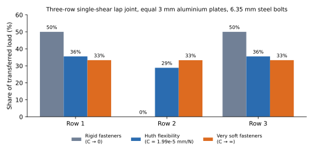
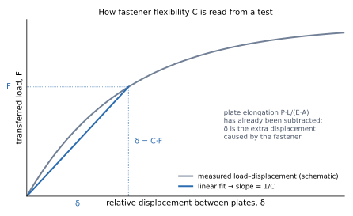
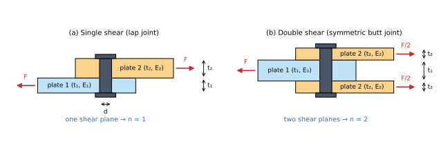
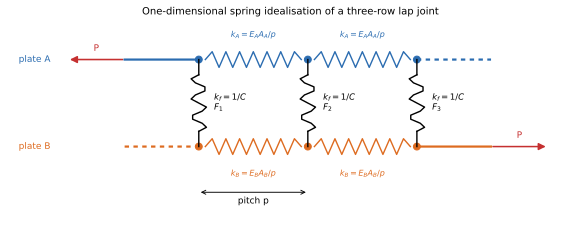
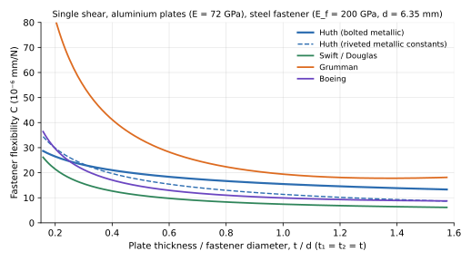

# The Huth Formula for Fastener Flexibility: A Beginner's Guide

*An introduction to fastener flexibility (compliance) in mechanically fastened joints, built around the semi-empirical formula published by Heimo Huth (1984, 1986).*

---

## Contents

1. [Who this is for and what you will learn](#1-who-this-is-for-and-what-you-will-learn)
2. [Why fastener flexibility matters](#2-why-fastener-flexibility-matters)
3. [Compliance versus stiffness](#3-compliance-versus-stiffness)
4. [Single shear and double shear](#4-single-shear-and-double-shear)
5. [The Huth formula](#5-the-huth-formula)
6. [Unit consistency](#6-unit-consistency)
7. [Worked examples](#7-worked-examples)
8. [Using the result: load distribution in a three-row joint](#8-using-the-result-load-distribution-in-a-three-row-joint)
9. [Comparison with other fastener flexibility formulas](#9-comparison-with-other-fastener-flexibility-formulas)
10. [Limitations and assumptions](#10-limitations-and-assumptions)
11. [Practical checklist](#11-practical-checklist)
12. [References](#12-references)

---

## 1. Who this is for and what you will learn

This paper is written for engineers who are new to the analysis of bolted and riveted joints and who have met the term *fastener flexibility* (or *fastener compliance*, or *bolt constant*) for the first time, usually in the context of a finite element model, a load-distribution spreadsheet, or a fatigue analysis of a splice.

By the end you should be able to:

- explain, in one paragraph, why the fasteners in a multi-row joint do **not** share the load equally and why their flexibility decides how unequal the sharing is;
- state the difference between compliance $C$ and stiffness $k$ and convert between them;
- write down the Huth formula from memory, say what every symbol means, and pick the right constants for a bolted metallic, riveted metallic, or bolted graphite/epoxy joint;
- carry out the calculation by hand in either SI or US customary units without mixing them up;
- know which other formulas you are likely to meet (Tate & Rosenfeld, Swift/Douglas, Boeing, Grumman) and when each one is normally used;
- recognise the limits of any of these formulas so that you do not over-trust the result.

The mathematics is deliberately kept at the level of algebra and simple springs. Nothing more than $F = k\,\delta$ is needed.

---

## 2. Why fastener flexibility matters

### 2.1 The problem: rows of fasteners do not share load equally

Consider a lap joint in which plate A hands its load $P$ over to plate B through three rows of fasteners (Figure 1 shows the result; Figure 4 shows the idealisation). A first-year design course would divide $P$ by three and size every fastener for $P/3$. That is fine for an ultimate-strength check of a ductile metallic joint, because near failure the plates yield locally in bearing and the loads equalise, an effect Tate and Rosenfeld observed and reported in 1946 [1].

In the *elastic* range, however, which is where fatigue lives are decided, the rows carry very different loads. The reason is compatibility. Between rows 1 and 2, plate A still carries most of $P$ and stretches a lot; plate B carries only what row 1 has transferred and stretches very little. The two plates are pinned together at row 1 and again at row 2, so the difference in their stretch has to be taken up by something. That something is the deformation of the fasteners and of the hole walls: the fasteners bend, shear, tilt, and press into the holes. The end rows therefore have to deform the most, and because they deform the most they carry the most load.

How unequal the sharing is depends on one ratio: how stiff the fasteners are compared with the pieces of plate between them.

- If the fasteners were **perfectly rigid**, the two end rows of a three-row joint between equal plates would carry 50 % each and the middle row would carry nothing.
- If the fasteners were **infinitely soft**, every row would carry exactly one third.
- Real fasteners sit in between, and the Huth formula tells you where.

*Figure 1. Load share per row in a three-row, single-shear lap joint between two equal 3 mm aluminium plates with 6.35 mm steel bolts at 25 mm pitch. The bars were computed with the spring model of Section 8. Rigid fasteners give 50 / 0 / 50 %; the Huth flexibility for this joint gives 36 / 29 / 36 %.*

### 2.2 Why anyone should care

Three practical consequences follow from Figure 1.

1. **Fatigue life.** The end fastener in a metallic splice sees more load than the average, and its hole sees a higher bearing stress and a higher stress concentration. Fatigue cracks start there. A fatigue analysis that assumes equal load sharing can be optimistic by a large factor. Huth's own motivation, stated in the title of his paper, was the *prediction of load transfer and fatigue life for multiple-row joints* [2, 3].
2. **Composite joints.** Carbon-fibre laminates do not yield in bearing the way aluminium does, so the elastic load distribution stays unequal right up to failure. Bolt-load sharing is a first-order design variable for composite splices, not a refinement [8].
3. **Finite element models.** Whenever fasteners are represented by 1-D elements (springs, `CBUSH`, `CFAST`, connector elements) the analyst has to type in a stiffness. A stiffness that is far too high pushes load into the end rows; one that is far too low smears it out. The Huth formula is one of the most common sources of that number in aerospace practice [9, 11, 12].

---

## 3. Compliance versus stiffness

### 3.1 Definitions

Take a single fastener transferring a load $F$ from one plate to another. Measure the relative displacement $\delta$ between the two plates at the fastener, *after* subtracting the ordinary elastic stretch of the plates themselves ($PL/EA$). Within the elastic range the two are approximately proportional:

$$
\delta = C\,F \qquad\Longleftrightarrow\qquad F = k\,\delta, \qquad k = \frac{1}{C}.
$$

- $C$ is the **fastener flexibility** (also *compliance*; Tate and Rosenfeld called it the *bolt constant*). Its units are length per force: mm/N or in/lbf.
- $k$ is the **fastener stiffness** (also *spring rate*). Its units are force per length: N/mm or lbf/in.

They carry exactly the same information. Formulas in the literature are almost always written for $C$, because the physical contributions to $\delta$ simply add up; finite element codes almost always ask for $k$. You will constantly be inverting one to get the other, so keep both symbols in your head.

*Figure 2. Schematic of how $C$ is read from a test. The measured curve is non-linear; $C$ is the inverse slope of a straight line fitted to its elastic part. Huth unloaded his specimens from about two thirds of the maximum load and fitted the linear portion of the reloading curve, which removes the initial settling and slip of the joint [2, 3].*

### 3.2 What is inside $\delta$

The displacement $\delta$ is a lump sum. It contains everything that lets the two plates move relative to each other at the fastener except the plate stretch that has already been subtracted [9]:

- shear deformation of the fastener shank,
- bending of the shank across the grip,
- tilting (rotation) of the fastener in a single-shear joint,
- bearing (local crushing) deformation of the hole walls in each plate,
- bearing deformation of the fastener shank itself,
- take-up of any hole clearance and, at low loads, friction between the plates.

Because so many mechanisms are lumped together, all the "formulas" for $C$ are either simplified mechanics (a beam on elastic supports) or curve fits to tests, or a mixture of both. The Huth formula is a mixture: the *form* of the expression comes from bearing mechanics, and the *constants* come from a large test programme.

---

## 4. Single shear and double shear

The one geometric distinction every formula makes is the number of shear planes, written $n$ in the Huth formula.

*Figure 3. (a) Single shear: two plates, one shear plane, $n = 1$. (b) Double shear: a centre plate between two outer plates, two shear planes, $n = 2$. In (b) the Huth convention is that plate 1 is the centre plate and plate 2 is one of the two identical outer plates.*

- **Single shear ($n = 1$).** Two plates overlap and the fastener crosses one interface. The load path is eccentric, so the fastener tilts and the joint bends (*secondary bending*). Single-shear joints are the more flexible of the two.
- **Double shear ($n = 2$).** A centre plate is sandwiched between two outer plates (straps). The fastener crosses two interfaces and each carries half the load. The load path is symmetric, there is no tilt, and the joint is markedly stiffer. Butt splices and lugs are double-shear joints.

A word on bookkeeping. The Huth formula, like Tate and Rosenfeld's, gives the **total** flexibility of the fastener between the centre plate and *both* outer plates together. If your finite element model represents a double-shear fastener as two separate springs, one per shear plane, each spring must be given flexibility $2C$ (stiffness $k/2$) so that the two in parallel add up to the right total [9].

---

## 5. The Huth formula

### 5.1 Origin

In the early 1980s Heimo Huth ran an extensive test programme at the Fraunhofer Institut für Betriebsfestigkeit (LBF) in Darmstadt, measuring the load-displacement behaviour of single- and double-shear specimens, riveted and bolted, with metallic and graphite/epoxy plates, under both quasi-static and flight-by-flight loading. The primary variables were plate material, clamping (grip) length, and fastener diameter and material; the secondary variables were clamping force, condition of the faying surfaces, hole fit and head type [2, 3, 4]. The work formed his doctoral dissertation at the Technische Universität München and was issued as LBF report FB-172 in 1984 [2]. The English-language paper most people cite appeared in ASTM STP 927 in 1986 [3].

Huth found that the formulas then available (Tate & Rosenfeld, the Douglas formula, the Boeing formula) were "not exact or at least not applicable for a wider range of joint geometries", and fitted a new expression to his own data that covered riveted and bolted metallic joints and bolted graphite/epoxy joints with a single functional form [3].

### 5.2 The formula

$$
C \;=\; \left(\frac{t_1 + t_2}{2d}\right)^{a}\;\frac{b}{n}\;\left[\frac{1}{t_1 E_1} \;+\; \frac{1}{n\,t_2 E_2} \;+\; \frac{1}{2\,t_1 E_f} \;+\; \frac{1}{2\,n\,t_2 E_f}\right]
$$

with the constants

| Joint type                          | $a$   | $b$   |
| ----------------------------------- | ----- | ----- |
| Bolted metallic joints              | 2/3   | 3.0   |
| Riveted metallic joints             | 2/5   | 2.2   |
| Bolted graphite/epoxy joints        | 2/3   | 4.2   |

and

| Configuration  | $n$ |
| -------------- | --- |
| Single shear   | 1   |
| Double shear   | 2   |

These values are the ones given in Huth's paper and reproduced consistently by later reviews, theses, and commercial software documentation [3, 9, 11, 12, 13].

### 5.3 Meaning of every symbol

| Symbol  | Meaning                                                                                                             | Units      |
| ------- | ------------------------------------------------------------------------------------------------------------------- | ---------- |
| $C$     | fastener flexibility (compliance); $k = 1/C$ is the stiffness                                                       | mm/N, in/lbf |
| $t_1$   | thickness of plate 1. In double shear, the **centre** plate.                                                        | mm, in     |
| $t_2$   | thickness of plate 2. In double shear, **one** of the two identical outer plates.                                   | mm, in     |
| $d$     | fastener (shank / hole) diameter                                                                                    | mm, in     |
| $E_1$, $E_2$ | Young's modulus of plate 1 and plate 2 in the load direction                                                   | MPa, psi   |
| $E_f$   | Young's modulus of the fastener                                                                                     | MPa, psi   |
| $n$     | number of shear planes: 1 for single shear, 2 for double shear                                                      | –          |
| $a$, $b$ | empirical constants depending on joint type (table above)                                                          | –          |

### 5.4 Meaning of every term

It helps to read the formula as *(geometry factor) × (joint-type factor) × (sum of bearing compliances)*.

**The bracket: four bearing-type terms.** Each term has the form $1/(tE)$. That is the compliance you get if you assume the bearing stress on a hole wall, $\sigma_{br} = F/(t\,d)$, produces a local displacement proportional to the diameter, $\delta = d\,\sigma_{br}/E = F/(tE)$. The plate-bearing terms in the 1946 Tate and Rosenfeld formula have exactly this form [1, 8]. Reading the bracket term by term:

1. $\dfrac{1}{t_1 E_1}$: bearing deformation of the hole in plate 1. Thin or soft plate 1 → large term.
2. $\dfrac{1}{n\,t_2 E_2}$: bearing deformation of the hole(s) in plate 2. In double shear there are two outer plates, so the effective bearing thickness is $n\,t_2 = 2t_2$ and the term halves.
3. $\dfrac{1}{2\,t_1 E_f}$: bearing deformation of the **fastener shank** where it presses against plate 1. The factor 2 is part of Huth's fit; it reflects that the fastener contributes less than the plate for the same thickness.
4. $\dfrac{1}{2\,n\,t_2 E_f}$: bearing deformation of the fastener shank against plate 2, again with $n$ for the number of outer plates.

Because $E_f$ (steel or titanium, 110–210 GPa) is usually much larger than $E_1$, $E_2$ (aluminium ≈ 72 GPa, carbon laminate ≈ 40–70 GPa), terms 3 and 4 are typically 15–25 % of the bracket for steel or titanium fasteners, and about a third for aluminium rivets in aluminium sheet. The plate terms dominate.

**The geometry factor $\left(\dfrac{t_1+t_2}{2d}\right)^{a}$.** The ratio of the mean plate thickness to the fastener diameter, $\bar t/d$, controls how much the fastener bends and shears across the grip. A long, thin fastener (large $\bar t/d$) is a flexible beam and the joint is softer; a short, fat one is stiff. Huth captured this with a power law. With $a = 2/3$ for bolts the factor varies more strongly with $\bar t/d$ than with $a = 2/5$ for rivets, consistent with a driven rivet filling its hole and bending less than a bolt in a clearance hole. Note that for $\bar t/d < 1$, which is the normal range for sheet-metal joints, the factor is *less than one* and reduces $C$.

**The joint-type factor $b/n$.** $b$ is a pure scale factor from the test fit:

- $b = 3.0$ for bolted metallic joints is the baseline;
- $b = 2.2$ for riveted metallic joints: rivets came out stiffer than bolts in the tests, which is usually attributed to the driven shank expanding to fill the hole (no clearance) and clamping the sheets;
- $b = 4.2$ for bolted graphite/epoxy joints: laminates came out softer in bearing than the $1/(tE)$ terms with the in-plane modulus would suggest, plausibly because the bearing response of a laminate is governed by the resin-dominated through-thickness and compressive behaviour rather than by the fibre-dominated in-plane modulus; the fit absorbs this with a 40 % higher $b$.

Dividing by $n$ is the main double-shear correction: two shear planes in parallel roughly halve the flexibility. Together with the $n$ inside the bracket, the double-shear value for a given $t_1$, $t_2$ and $d$ ends up somewhat less than half the single-shear value.

### 5.5 A caution about a widely copied misprint

The version of the formula printed in ASTM STP 927 has been reported by several practitioners to contain a typographical error in the third term of the bracket, printing $1/(n\,t_1 E_f)$ where the original 1984 report has $1/(2\,t_1 E_f)$ [14, 15]. The two are identical for double shear ($n = 2$) but differ by a factor of two in that term for single shear, and the misprinted form gives a *different answer depending on which plate you call number 1*, which is physically unreasonable. The form given in Section 5.2, with the 2, is symmetric under swapping plates 1 and 2 when $E_1 = E_2$ and is the one used in the Söderberg thesis, the Eremin review, and current software implementations [9, 11, 12, 13]. If you see the $n$ version in an old spreadsheet, check it.

---

## 6. Unit consistency

The Huth formula contains no hidden unit conversions. It is *dimensionally homogeneous*: the bracket has units of 1/(length × stress) = length/force, and the two prefactors are dimensionless. That means it works in **any consistent unit system**, provided you never mix systems inside one calculation.

| Quantity        | SI (preferred)      | US customary            |
| --------------- | ------------------- | ----------------------- |
| $t_1$, $t_2$, $d$ | mm                | in                      |
| $E_1$, $E_2$, $E_f$ | MPa (= N/mm²)   | psi (= lbf/in²)         |
| $C$             | mm/N                | in/lbf                  |
| $k = 1/C$       | N/mm                | lbf/in                  |

Three traps catch beginners:

1. **GPa and mm.** Material data sheets quote $E$ in GPa; if you keep thickness in mm you must enter $E$ in MPa (72 GPa = 72 000 MPa). With mm and GPa you would get $C$ in mm/kN, which is a factor of 1000 out and easy to miss.
2. **Msi and inches.** In US units $E$ is often written "10.5 Msi"; enter it as $10.5\times10^{6}$ psi.
3. **Converting the answer.** $1\ \text{lbf/in} = 4.448\,\text{N} / 25.4\,\text{mm} = 0.1751\ \text{N/mm}$. Equivalently $1\ \text{in/lbf} = 5.710\ \text{mm/N}$. Example 3 below checks this.

A sanity range: for typical aerospace sheet joints (2–6 mm aluminium, 4–8 mm fasteners), $C$ comes out between roughly $5\times10^{-6}$ and $5\times10^{-5}$ mm/N, i.e. stiffnesses of about 20 to 200 kN/mm. If you get $10^{-2}$ or $10^{-9}$, check your units.

---

## 7. Worked examples

All arithmetic below is shown to four significant figures so that you can reproduce it on a calculator.

### Example 1: single-shear bolted aluminium joint (SI units)

**Given.** Two aluminium plates, $t_1 = 3.0$ mm and $t_2 = 4.0$ mm, $E_1 = E_2 = 72\,000$ MPa, joined by a steel bolt $d = 6.35$ mm (1/4 in), $E_f = 200\,000$ MPa. Single shear.

**Constants.** Bolted metallic: $a = 2/3$, $b = 3.0$; single shear: $n = 1$.

**Step 1 – geometry factor.**

$$
\frac{t_1+t_2}{2d} = \frac{3.0 + 4.0}{2 \times 6.35} = 0.5512, \qquad 0.5512^{2/3} = 0.6722.
$$

**Step 2 – joint-type factor.** $b/n = 3.0/1 = 3.0$.

**Step 3 – the bracket.**

$$
\begin{aligned}
\frac{1}{t_1E_1} &= \frac{1}{3.0 \times 72\,000} = 4.630\times10^{-6} \\
\frac{1}{n\,t_2E_2} &= \frac{1}{1 \times 4.0 \times 72\,000} = 3.472\times10^{-6} \\
\frac{1}{2\,t_1E_f} &= \frac{1}{2 \times 3.0 \times 200\,000} = 0.833\times10^{-6} \\
\frac{1}{2\,n\,t_2E_f} &= \frac{1}{2 \times 1 \times 4.0 \times 200\,000} = 0.625\times10^{-6} \\
\text{sum} &= 9.560\times10^{-6}\ \text{mm/N}
\end{aligned}
$$

**Step 4 – combine.**

$$
C = 0.6722 \times 3.0 \times 9.560\times10^{-6} = 1.928\times10^{-5}\ \text{mm/N}, \qquad k = \frac{1}{C} = 51\,900\ \text{N/mm} \approx 51.9\ \text{kN/mm}.
$$

**Interpretation.** A 1 kN fastener load produces about 0.019 mm of relative displacement between the plates at this bolt. The two plate-bearing terms make up 85 % of the bracket; the fastener-bearing terms 15 %.

### Example 2: double-shear bolted aluminium splice (SI units)

**Given.** A 6.0 mm aluminium centre plate spliced with two 3.0 mm aluminium straps, $E_1 = E_2 = 72\,000$ MPa, by a steel bolt $d = 8.0$ mm, $E_f = 200\,000$ MPa. Double shear.

**Constants.** Bolted metallic: $a = 2/3$, $b = 3.0$; double shear: $n = 2$. Plate 1 is the centre plate ($t_1 = 6.0$ mm); plate 2 is one strap ($t_2 = 3.0$ mm).

**Step 1 – geometry factor.**

$$
\frac{t_1+t_2}{2d} = \frac{6.0 + 3.0}{2 \times 8.0} = 0.5625, \qquad 0.5625^{2/3} = 0.6814.
$$

**Step 2 – joint-type factor.** $b/n = 3.0/2 = 1.5$.

**Step 3 – the bracket.**

$$
\begin{aligned}
\frac{1}{t_1E_1} &= \frac{1}{6.0 \times 72\,000} = 2.315\times10^{-6} \\
\frac{1}{n\,t_2E_2} &= \frac{1}{2 \times 3.0 \times 72\,000} = 2.315\times10^{-6} \\
\frac{1}{2\,t_1E_f} &= \frac{1}{2 \times 6.0 \times 200\,000} = 0.417\times10^{-6} \\
\frac{1}{2\,n\,t_2E_f} &= \frac{1}{2 \times 2 \times 3.0 \times 200\,000} = 0.417\times10^{-6} \\
\text{sum} &= 5.463\times10^{-6}\ \text{mm/N}
\end{aligned}
$$

**Step 4 – combine.**

$$
C = 0.6814 \times 1.5 \times 5.463\times10^{-6} = 5.584\times10^{-6}\ \text{mm/N}, \qquad k = 179\,000\ \text{N/mm} \approx 179\ \text{kN/mm}.
$$

**Interpretation.** This double-shear bolt is about 3.5 times stiffer than the single-shear bolt of Example 1. Part of that is the larger diameter and thicker plates, and part is the symmetric load path. If you model it with two springs, one per shear plane, each spring gets $2C = 1.117\times10^{-5}$ mm/N, i.e. $k = 89.5$ kN/mm each.

### Example 3: single-shear riveted aluminium sheet (US customary units)

This example exists mainly to show the unit handling and the riveted constants.

**Given.** Two 0.063 in 2024-T3 sheets, $E_1 = E_2 = 10.5\times10^{6}$ psi, joined by a 5/32 in ($d = 0.156$ in) aluminium rivet, $E_f = 10.3\times10^{6}$ psi. Single shear.

**Constants.** Riveted metallic: $a = 2/5$, $b = 2.2$; $n = 1$.

$$
\frac{t_1+t_2}{2d} = \frac{0.126}{0.312} = 0.4038, \qquad 0.4038^{0.4} = 0.6958.
$$

$$
\text{bracket} = 2\times\frac{1}{0.063 \times 10.5\times10^{6}} + 2\times\frac{1}{2 \times 0.063 \times 10.3\times10^{6}} = 3.023\times10^{-6} + 1.541\times10^{-6} = 4.565\times10^{-6}\ \text{in/lbf}.
$$

$$
C = 0.6958 \times 2.2 \times 4.565\times10^{-6} = 6.987\times10^{-6}\ \text{in/lbf}, \qquad k = 143\,100\ \text{lbf/in}.
$$

**Unit check.** Converting: $k = 143\,100 \times 0.1751 = 25\,060$ N/mm. Redoing the whole calculation in SI ($t = 1.600$ mm, $d = 3.962$ mm, $E = 72\,395$ MPa, $E_f = 71\,016$ MPa) gives $C = 3.990\times10^{-5}$ mm/N and $k = 25\,060$ N/mm, the same number. The formula does not care which consistent system you use.

### Example 4: single-shear bolted carbon/epoxy joint (SI units)

**Given.** Two quasi-isotropic carbon/epoxy laminates, $t_1 = t_2 = 4.0$ mm, in-plane modulus $E_1 = E_2 = 55\,000$ MPa, joined by a titanium bolt $d = 6.35$ mm, $E_f = 110\,000$ MPa. Single shear.

**Constants.** Bolted graphite/epoxy: $a = 2/3$, $b = 4.2$; $n = 1$.

$$
\frac{t_1+t_2}{2d} = \frac{8.0}{12.7} = 0.6299, \qquad 0.6299^{2/3} = 0.7348.
$$

$$
\text{bracket} = 2\times\frac{1}{4.0 \times 55\,000} + 2\times\frac{1}{2 \times 4.0 \times 110\,000} = 9.091\times10^{-6} + 2.273\times10^{-6} = 1.136\times10^{-5}\ \text{mm/N}.
$$

$$
C = 0.7348 \times 4.2 \times 1.136\times10^{-5} = 3.507\times10^{-5}\ \text{mm/N}, \qquad k = 28\,500\ \text{N/mm}.
$$

**Interpretation.** Had you used the metallic constants ($b = 3.0$) by mistake you would have obtained $C = 2.505\times10^{-5}$ mm/N; the composite $b$ makes the fastener exactly $4.2/3.0 = 1.4$ times more flexible. For a hybrid metal-to-composite joint Huth gives no constant; some industrial implementations apply $b = 3.0$ to the metallic plate's terms and $b = 4.2$ to the composite plate's terms [13]. Treat that as a convention rather than a validated result.

---

## 8. Using the result: load distribution in a three-row joint

To see what a flexibility of $C \approx 2\times10^{-5}$ mm/N actually does, put it into the simplest possible load-distribution model, the one Tate and Rosenfeld used in 1946 and that is still the basis of many spreadsheets and of ESDU 98012 [1, 10].

*Figure 4. One-dimensional idealisation. Each plate segment between rows is an axial spring $k_A = E_A A_A/p$ (cross-section $A$ = width × thickness, pitch $p$); each fastener is a shear spring $k_f = 1/C$ connecting the two plates.*

Between rows $i$ and $i+1$ compatibility requires

$$
C F_i + \frac{p}{E_B A_B}\sum_{j\le i} F_j \;=\; \frac{p}{E_A A_A}\Bigl(P - \sum_{j\le i} F_j\Bigr) + C F_{i+1},
$$

together with $\sum F_j = P$. For three rows this is three linear equations in $F_1, F_2, F_3$.

**Numbers.** Two 3.0 mm aluminium plates, 25 mm wide strip per fastener, pitch 25 mm, so $E A/p = 72\,000 \times 75 / 25 = 216\,000$ N/mm. Steel bolts $d = 6.35$ mm give, from the Huth formula with $t_1 = t_2 = 3.0$ mm, $C = 1.988\times10^{-5}$ mm/N and $k_f = 50\,300$ N/mm. The fastener is therefore about 0.23 times as stiff as a plate segment.

| Fastener model               | Row 1  | Row 2  | Row 3  |
| ---------------------------- | ------ | ------ | ------ |
| Rigid ($C \to 0$)            | 50.0 % | 0.0 %  | 50.0 % |
| Huth, $C = 1.99\times10^{-5}$ mm/N | 35.6 % | 28.9 % | 35.6 % |
| Ten times softer than Huth   | 33.6 % | 32.8 % | 33.6 % |
| Infinitely soft              | 33.3 % | 33.3 % | 33.3 % |

The end rows carry 7 % more than the "equal share" assumption, or, equivalently, the peak fastener load is 1.07 times the average. For a fatigue analysis that 7 % is not negligible, because fatigue life is roughly proportional to the third or fourth power of stress. For thicker plates, stiffer fasteners, or more rows, the imbalance grows quickly; the table below shows how the end-row share depends on the stiffness ratio for the same three-row joint.

| $k_f / (EA/p)$ | 0.1 | 0.3 | 1 | 3 | 10 | 30 |
| --- | --- | --- | --- | --- | --- | --- |
| End rows | 34.4 % | 36.1 % | 40.0 % | 44.4 % | 47.8 % | 49.2 % |
| Middle row | 31.2 % | 27.8 % | 20.0 % | 11.1 % | 4.3 % | 1.6 % |

Two further observations from the same model are worth remembering:

- **Sensitivity is one-sided.** Once $k_f/(EA/p)$ is below about 0.3 the load distribution is insensitive to the exact value of $C$. Tate and Rosenfeld noted in 1946 that "the analytically determined bolt-load relationships are relatively insensitive to appreciable changes in magnitude of the bolt constant $C$" [1]. This is why a formula with ±30 % scatter can still be very useful.
- **Unequal plates move the peak.** If plate A is 6 mm and plate B 3 mm, rigid fasteners give 33 / 0 / 67 %: the row where the *thin* plate is fully loaded takes the most. With the Huth value the split is 31 / 30 / 40 %.

---

## 9. Comparison with other fastener flexibility formulas

Huth's is not the only formula, and you will meet the others in company manuals, legacy spreadsheets, and software menus. Below are the ones most frequently encountered, written in a common notation ($t_1, t_2$ plate thicknesses; $E_1, E_2$ plate moduli; $d$ diameter; $E_f$, $G_f$ fastener moduli; $A_f = \pi d^2/4$; $I_f = \pi d^4/64$).

### 9.1 Tate & Rosenfeld (1946)

The origin of the whole subject. Tate and Rosenfeld (NACA TN 1051) analysed symmetric butt joints (double shear) of 24S-T aluminium plates with steel bolts, treating the bolt as a fixed-end beam loaded by the bearing pressures and summing four contributions: bolt shear, bolt bending, bolt bearing, and plate bearing [1]. Written out for a centre plate $p$ and two identical straps $s$, as transcribed in the NASA report by Nelson, Bunin and Hart-Smith [8]:

$$
C = \underbrace{\frac{2t_s + t_p}{3\,G_f A_f}}_{\text{bolt shear}}
+ \underbrace{\frac{8t_s^3 + 16t_s^2 t_p + 8t_s t_p^2 + t_p^3}{192\,E_f I_f}}_{\text{bolt bending}}
+ \underbrace{\frac{2t_s + t_p}{t_s t_p E_f}}_{\text{bolt bearing}}
+ \underbrace{\frac{1}{t_s E_s} + \frac{1}{t_p E_p}}_{\text{plate bearing}} .
$$

The plate-bearing terms are the $1/(tE)$ terms that reappear inside the Huth bracket. Tate and Rosenfeld themselves flagged the bearing terms as the least certain part [1]. Different secondary sources transcribe the constants slightly differently, so if you need this formula go back to the original.

*When it is used:* double-shear metallic joints, hand analyses in the classical NACA tradition, and as the basis of the Nelson et al. (Douglas, 1983) composite-joint version, which adapted it to orthotropic laminates using $E = \sqrt{E_L E_T}$ and to single shear by deleting the bending term and multiplying the bearing terms by $(1 + 3\beta)$, with $\beta \approx 0.15$ for protruding-head bolts and about 0.5 for countersunk fasteners [8].

### 9.2 Swift / Douglas (1971)

Swift introduced a very simple expression during the fail-safe (damage-tolerance) development of the DC-10 fuselage, for aluminium sheet with aluminium rivets [5]:

$$
\delta = \frac{F}{E\,d}\left[5.0 + 0.8\left(\frac{d}{t_1} + \frac{d}{t_2}\right)\right]
\qquad\Longrightarrow\qquad
C = \frac{5}{d\,E_f} + 0.8\left(\frac{1}{t_1 E_1} + \frac{1}{t_2 E_2}\right),
$$

where the right-hand form is the generalisation to dissimilar materials that most later authors use [11, 13]. In Swift's original all parts were aluminium so there was only one $E$. The first term represents the fastener (shear and bending, scaling with diameter) and the second the plate bearing.

*When it is used:* thin-sheet riveted fuselage structure, stiffened-panel crack-growth and residual-strength models where the fasteners connect a cracked skin to stringers or frames, and generally wherever the analysis lineage is Douglas / McDonnell Douglas damage tolerance. It tends to give the **stiffest** answer of the common formulas.

### 9.3 Boeing

Boeing's fastener flexibility methods come from proprietary design manuals and are not published in the open literature; the form usually quoted in reviews and theses [11, 12, 13] is

$$
C = \frac{2^{(t_1/d)^{0.85}}}{t_1}\left(\frac{1}{E_1} + \frac{3}{8E_f}\right) + \frac{2^{(t_2/d)^{0.85}}}{t_2}\left(\frac{1}{E_2} + \frac{3}{8E_f}\right)
$$

for single shear, with the base 2 replaced by 1.25 for double shear. Each plate contributes a bearing term plus a fastener term ($3/8E_f$), scaled by an exponential in $t/d$ that plays the role of Huth's power-law geometry factor. A second, older Boeing form, closer in structure to Tate and Rosenfeld with explicit shear and bending terms, is also in circulation (the "Boeing 1" of Eremin et al. [11]).

*When it is used:* Boeing-heritage metallic and composite analyses. In the comparison of Eremin et al. against 3-D finite element models of composite bolted joints, the exponential Boeing form matched best for thin and medium plates while Huth matched best for thick plates [11].

### 9.4 Grumman

An empirical formula from Grumman Aerospace, cited through Saab's internal literature (Jarfall 1983) and used in the development of the Saab 37 Viggen [9, 6]:

$$
C = \frac{(t_1 + t_2)^2}{E_f\,d^3} + 3.72\left(\frac{1}{t_1 E_1} + \frac{1}{t_2 E_2}\right).
$$

The first term is a bending term (grip squared over diameter cubed); the second is the familiar plate-bearing pair with a large empirical multiplier.

*When it is used:* single shear only; it was derived for single-shear tests and gives poor results in double shear [9]. It is the **softest** of the common formulas and was used by Saab for composite bolted joints [9].

### 9.5 Analytical methods: Barrois and ESDU

Barrois (1978) derived fastener flexibility analytically by treating the fastener as a beam on an elastic foundation, with clamped-head and free-head variants [7]. ESDU data item 98012 provides a similar theory together with a program for the load distribution in multi-bolt lap joints [10]. Both are more general in principle but, in the comparisons run at Saab and Linköping, Barrois with clamped heads predicted stiffnesses up to about four times higher than Huth or Grumman [9]. They are mentioned here so you recognise the names; this paper does not develop them.

### 9.6 Numerical comparison

For the joint of Example 1 (single shear, 3 mm / 4 mm aluminium, 6.35 mm steel bolt):

| Formula               | $C$ (mm/N)              | $k$ (kN/mm) | Relative to Huth |
| --------------------- | ----------------------- | ----------- | ---------------- |
| Swift / Douglas       | $1.04\times10^{-5}$     | 96.0        | 0.54             |
| Boeing (single shear) | $1.39\times10^{-5}$     | 72.1        | 0.72             |
| **Huth (bolted metallic)** | $1.93\times10^{-5}$ | 51.9        | 1.00             |
| Grumman               | $3.11\times10^{-5}$     | 32.2        | 1.61             |

For the joint of Example 2 (double shear, 6 mm centre plate, 3 mm straps, 8 mm steel bolt):

| Formula                       | $C$ (mm/N)              | $k$ (kN/mm) | Relative to Huth |
| ----------------------------- | ----------------------- | ----------- | ---------------- |
| **Huth (bolted metallic, $n = 2$)** | $5.58\times10^{-6}$ | 179       | 1.00             |
| Boeing (double shear)         | $8.92\times10^{-6}$     | 112         | 1.60             |
| Tate & Rosenfeld              | $1.16\times10^{-5}$     | 86.3        | 2.08             |

A spread of a factor of two to three between formulas for the same joint is normal, and Figure 5 shows it persists across the whole practical range of $t/d$. The formulas agree on the *trend* (thinner plates relative to the diameter → more flexible) but not on the absolute value, because each was fitted to a different family of specimens with different fits, clamp-ups, head styles and test procedures [9, 11, 12].

*Figure 5. Fastener flexibility versus $t/d$ (equal plates) from the four empirical formulas, for aluminium plates and a 6.35 mm steel fastener in single shear. The dashed line shows the Huth formula with riveted constants for the same geometry.*

### 9.7 Which one should you use?

- **Follow the method your organisation's stress manual or certification basis prescribes.** Fastener flexibility numbers are almost always used in combination with allowables, test correlations, and severity factors that were calibrated with a particular formula. Swapping formulas mid-stream breaks that calibration.
- **If you have a free choice for a metallic or carbon/epoxy joint, Huth is the usual default.** It is the only one of the common formulas that (i) was derived from tests of both single- and double-shear specimens, (ii) covers bolted, riveted and composite joints with one expression, and (iii) has been repeatedly found to sit close to detailed 3-D finite element results, particularly for thicker plates [9, 11, 12]. It is the default in several commercial fastener-modelling tools [13].
- **Use Swift for thin riveted fuselage skin** if the surrounding damage-tolerance methodology (stiffened-panel crack-growth models) was built on it.
- **Do not use Grumman for double shear.**
- **Bracket the answer.** Because the load distribution is insensitive to $C$ below a certain stiffness ratio (Section 8) but sensitive above it, a robust practice for critical joints is to run the analysis with the softest and stiffest plausible values and design for the envelope.

---

## 10. Limitations and assumptions

Every fastener flexibility formula, Huth's included, rests on assumptions that a beginner should know before quoting a number to three significant figures.

1. **Linearity.** $C$ is a single constant, but the real load-displacement curve is non-linear (Figure 2): hole clearance and friction at low load, bearing yield at high load. Huth's constant is a secant fitted to the reloading branch after unloading from about two thirds of the maximum load [2, 3]. It describes the joint in its stabilised, elastic working range, not the first loading cycle or the approach to failure.

2. **Empirical range.** The constants $a$ and $b$ were fitted to Huth's specimens: aluminium alloys and graphite/epoxy laminates, steel and titanium bolts, aluminium rivets, thickness-to-diameter ratios typical of aircraft structure. Extrapolating to very thick joints ($\bar t/d \gg 1$), to steel or titanium plates, to glass or aramid composites, to plastics, or to interference-fit or blind fasteners is exactly that, extrapolation. Later comparisons with 3-D finite element models report average errors around 3–8 % for Huth in some thickness ranges and 30 % in others [11].

3. **Secondary effects are averaged, not modelled.** Clamping force (bolt preload), faying-surface condition (sealant, primer, bare), hole fit (clearance vs. interference), and head type (protruding vs. countersunk) all change the measured flexibility, sometimes by tens of percent. Huth investigated these as secondary parameters [3] but the formula carries no explicit variable for any of them. If your joint is unusual in one of these respects, the formula is a starting estimate only.

4. **Fastener material enters only through $E_f$.** A steel bolt and a titanium bolt of the same diameter differ in the formula only through the two small fastener-bearing terms. Differences in thread run-out, shank-to-grip ratio, or head style are not represented.

5. **In-plane modulus for composites.** For laminates $E_1$, $E_2$ should be the laminate modulus in the load direction. Highly orthotropic layups (very few ±45° or 90° plies) fall outside the quasi-isotropic-dominated data Huth used; the Nelson et al. approach of using $\sqrt{E_L E_T}$ is one way to be more careful [8].

6. **Single-spring assumption for double shear.** The formula gives the total flexibility between the centre plate and both straps. It assumes the two shear planes behave identically; unequal straps or a single strap plus a thick fitting need engineering judgement, and the "$2C$ per spring" rule of Section 4 applies when the model has one spring per plane [9].

7. **It is a flexibility, not a strength.** $C$ says nothing about bearing, shear-out, net-section or fastener shear allowables. It only tells you how the load is shared, which you then feed into those strength checks.

8. **Finite element calibration.** The number that goes into a `CBUSH` or connector element is not automatically the number from the formula. Depending on how the plates are meshed (shell vs. solid, offset vs. coplanar), how the fastener element is attached (rigid spiders, beams, direct nodes), and whether secondary bending is captured elsewhere in the model, some of the flexibility is already present in the mesh and the input stiffness should be calibrated on a single-fastener model before being used in a large one [9, 12].

9. **Scatter.** Nominally identical fasteners in Tate and Rosenfeld's 1946 tests deflected amounts that differed by up to 35 % [1]. No formula can be more accurate than the phenomenon it describes. The good news, repeated throughout this paper, is that the load distribution is much less sensitive to $C$ than $C$ is to its inputs.

---

## 11. Practical checklist

Before you write down a Huth flexibility:

- [ ] Decide which plate is 1 and which is 2. In double shear, plate 1 is the **centre** plate and $t_2$ is the thickness of **one** outer plate.
- [ ] Set $n$: 1 for single shear, 2 for double shear.
- [ ] Pick $a$, $b$ from the joint type: bolted metallic (2/3, 3.0), riveted metallic (2/5, 2.2), bolted graphite/epoxy (2/3, 4.2).
- [ ] Put all lengths in mm and all moduli in MPa (or all lengths in inches and all moduli in psi). Never mix.
- [ ] Check the bracket's third term is $1/(2\,t_1E_f)$, not $1/(n\,t_1E_f)$.
- [ ] Sanity-check: $C$ should be of order $10^{-6}$–$10^{-5}$ mm/N for typical aircraft joints; swapping plates 1 and 2 should not change the single-shear answer when $E_1 = E_2$.
- [ ] Invert to $k = 1/C$ for the finite element input, and halve $k$ per spring if your double-shear model uses one spring per shear plane.
- [ ] Record which formula and constants you used. Someone will have to reproduce it.

---

## 12. References

1. Tate, M. B., and Rosenfeld, S. J., *Preliminary Investigation of the Loads Carried by Individual Bolts in Bolted Joints*, NACA Technical Note 1051, Langley Memorial Aeronautical Laboratory, May 1946. Available from the NASA Technical Reports Server, document 19930081668: https://ntrs.nasa.gov/citations/19930081668

2. Huth, H., *Zum Einfluß der Nietnachgiebigkeit mehrreihiger Nietverbindungen auf die Lastübertragungs- und Lebensdauervorhersage*, Dissertation, Technische Universität München; Fraunhofer-Institut für Betriebsfestigkeit (LBF), Darmstadt, Bericht Nr. FB-172, 1984. (An English version, *Influence of Fastener Flexibility on Load Transfer and Fatigue Life Predictions for Multirow Bolted and Riveted Joints*, is catalogued by NTIS as N85-16219.)

3. Huth, H., "Influence of Fastener Flexibility on the Prediction of Load Transfer and Fatigue Life for Multiple-Row Joints," in *Fatigue in Mechanically Fastened Composite and Metallic Joints*, ASTM STP 927, J. M. Potter, Ed., American Society for Testing and Materials, Philadelphia, 1986, pp. 221–250 (symposium held in Charleston, SC, 18–19 March 1985). https://doi.org/10.1520/STP29062S

4. Huth, H., *Experimental Determination of Fastener Flexibilities*, LBF-Bericht 4980, Fraunhofer-Institut für Betriebsfestigkeit, Darmstadt, 1983. (Cited in [9].)

5. Swift, T., "Development of the Fail-Safe Design Features of the DC-10," in *Damage Tolerance in Aircraft Structures*, ASTM STP 486, American Society for Testing and Materials, 1971, pp. 164–214. https://doi.org/10.1520/STP26678S

6. Jarfall, L., *Shear Loaded Fastener Installations*, Report KH R-3360, Saab-Scania AB, Aircraft Division, Linköping, 1983. (Internal Saab report; the source of the Grumman, Boeing and Douglas formulas as cited in [9].)

7. Barrois, W., "Stresses and displacements due to load transfer by fasteners in structural assemblies," *Engineering Fracture Mechanics*, Vol. 10, No. 1, 1978, pp. 115–176. https://doi.org/10.1016/0013-7944(78)90055-3

8. Nelson, W. D., Bunin, B. L., and Hart-Smith, L. J., *Critical Joints in Large Composite Aircraft Structure*, NASA Contractor Report 3710, Douglas Aircraft Company, August 1983. Available from the NASA Technical Reports Server, document 19870001540: https://ntrs.nasa.gov/citations/19870001540

9. Söderberg, J., *A Finite Element Method for Calculating Load Distributions in Bolted Joint Assemblies*, Master's thesis, Linköping University, Department of Management and Engineering, 2012. http://www.diva-portal.org/smash/get/diva2:555866/FULLTEXT01.pdf

10. ESDU 98012, *Flexibility of, and Load Distribution in, Multi-Bolt Lap Joints Subject to In-Plane Axial Loads*, Engineering Sciences Data Unit, London (data item with program ESDUpac A9812; cited in [9, 12] as the 2001 issue). https://www.esdu.com/cgi-bin/ps.pl?p=esdu_98012

11. Eremin, V., Bolshikh, A., Koroliskii, V., and Shelkov, K., "Methods for flexibility determination of bolted joints: empirical formula review," *Journal of Physics: Conference Series*, Vol. 1925, 2021, 012058. https://doi.org/10.1088/1742-6596/1925/1/012058

12. Gunbring, F., *Prediction and Modelling of Fastener Flexibility Using FE*, Master's thesis, Linköping University, 2008. http://urn.kb.se/resolve?urn=urn:nbn:se:liu:diva-11428

13. Idaero Solutions, *NaxToPy documentation: N2PUpdateFastener*, section on fastener stiffness methods (Huth, Boeing, Tate & Rosenfeld, Grumman, Swift, Nelson). https://idaerosolutions.com/NaxToDocumentation/NaxToPy/3.2.0/N2PUpdateFastener.html (accessed September 2026). See also Altair HyperWorks, *\*fastenercreation* reference, which lists the same Huth constants: https://help.altair.com/2024/hwdesktop/hwd/topics/reference/hm/_fastenercreation.htm

14. Eng-Tips Forums, thread "Huth Formula for Fastener Flexibility" (discussion of the misprint in ASTM STP 927 relative to LBF report FB-172). https://www.eng-tips.com/threads/huth-formula-for-fastener-flexibility.192705/

15. P/A Engineering, *Huth Fastener Stiffness Calculator*, with notes on the difference between equation 31 of LBF report FB-172 and equation 1 of ASTM STP 927. https://www.p-over-a.co.uk/toolbox/Huth.aspx

16. Skorupa, A., and Skorupa, M., *Riveted Lap Joints in Aircraft Fuselage: Design, Analysis and Properties*, Solid Mechanics and Its Applications Vol. 189, Springer, Dordrecht, 2012. https://doi.org/10.1007/978-94-007-4282-6 (Covers analytical and experimental results on load transmission in mechanically fastened lap joints, including rivet flexibility.)

17. Chandregowda, S., and Reddy, G. R. C., "Evaluation of fastener stiffness modelling methods for aircraft structural joints," *AIP Conference Proceedings*, Vol. 1943, 2018, 020001. https://doi.org/10.1063/1.5029577

---

*Figures 1–5 in `figures/` were generated for this paper. Figures 1 and 5 are computed from the formulas as written above; Figures 2, 3 and 4 are schematic.*
