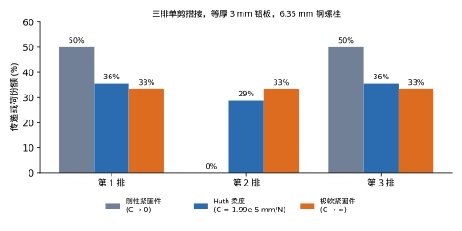
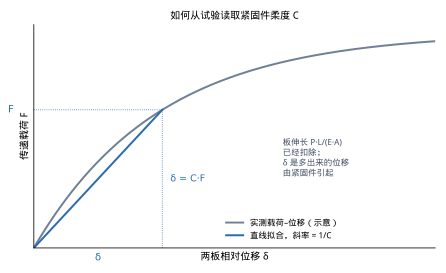
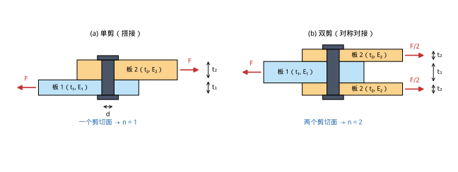
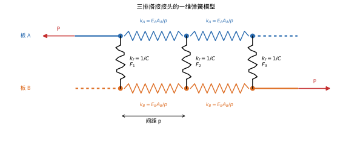
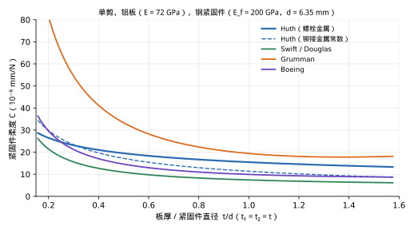

**English:** [The Huth Formula for Fastener Flexibility: A Beginner's Guide](huth-formula.md)

# Huth 紧固件柔度公式：入门导读

*面向初学机械连接分析的工程师，介绍紧固件柔度（顺应性），并围绕 Heimo Huth 于 1984、1986 年发表的半经验公式展开。*

---

## 目录

1. [读者与学习目标](#1-读者与学习目标)
2. [为什么紧固件柔度重要](#2-为什么紧固件柔度重要)
3. [柔度与刚度](#3-柔度与刚度)
4. [单剪与双剪](#4-单剪与双剪)
5. [Huth 公式](#5-huth-公式)
6. [单位一致性](#6-单位一致性)
7. [算例](#7-算例)
8. [用结果计算三排接头的载荷分配](#8-用结果计算三排接头的载荷分配)
9. [与其他紧固件柔度公式的比较](#9-与其他紧固件柔度公式的比较)
10. [局限与假设](#10-局限与假设)
11. [实用核对清单](#11-实用核对清单)
12. [参考文献](#12-参考文献)

---

## 1. 读者与学习目标

本文写给刚开始做螺栓、铆钉接头分析的工程师。你多半是在有限元模型、载荷分配表格或拼接接头的疲劳分析里，第一次遇到*紧固件柔度*（也叫*紧固件顺应性*，或*螺栓常数*）这个词。

读完之后，你应当能够：

- 用一段话说明，多排接头里的紧固件**并不**均分载荷，以及柔度如何决定这种不均匀到什么程度；
- 说清柔度 $C$ 和刚度 $k$ 的差别，并在二者之间换算；
- 默写 Huth 公式，讲清每个符号，并为螺栓金属接头、铆接金属接头或螺栓石墨/环氧接头选对常数；
- 用毫米和兆帕手算，并认出因单位混用而差了数量级的结果；
- 知道还会遇到哪些公式（Tate 与 Rosenfeld、Swift/Douglas、Boeing、Grumman），以及各自通常用在什么场合；
- 知道这些公式的限度，避免对结果过度信任。

数学只停留在代数和简单弹簧。用到的关系不超过 $F = k\,\delta$。

---

## 2. 为什么紧固件柔度重要

### 2.1 问题：各排紧固件并不均分载荷

考虑一个搭接接头：板 A 把载荷 $P$ 通过三排紧固件传给板 B（图 1 是结果，图 4 是理想化模型）。一年级设计课会把 $P$ 除以 3，每颗紧固件都按 $P/3$ 来设计。对延性金属接头做极限强度校核时，这样做是可以的，因为临近破坏时孔边局部挤压屈服，各排载荷会拉平。Tate 与 Rosenfeld 在 1946 年就观察到并报告了这一现象 [1]。

然而在*弹性*范围内——疲劳寿命正是在这个范围里决定的——各排承担的载荷相差很大。原因是变形协调。在第 1 排和第 2 排之间，板 A 仍承担 $P$ 的大部分，伸长很多；板 B 只承担第 1 排已经传过去的那一部分，伸长很少。两块板在第 1 排钉在一起，在第 2 排又钉在一起，所以它们伸长量的差必须由别的变形消化。消化这部分差的，就是紧固件和孔壁的变形：紧固件弯曲、剪切、倾斜，并挤入孔壁。因此端部两排必须产生最大的变形，而变形最大的排承担的载荷也最大。

分配有多不均匀，取决于一个比值：紧固件相对于排与排之间那段板有多刚。

- 若紧固件**完全刚性**，两块等厚板的三排接头中，两端各承担 50%，中间一排不承担载荷。
- 若紧固件**无限柔软**，每一排正好承担三分之一。
- 真实紧固件落在两者之间，Huth 公式告诉你落在哪里。

*图 1. 三排单剪搭接接头中各排的载荷份额。两块等厚 3 mm 铝板，6.35 mm 钢螺栓，间距 25 mm。柱状值按第 8 节的弹簧模型计算。刚性紧固件给出 50 / 0 / 50%；本接头的 Huth 柔度给出 36 / 29 / 36%。*

### 2.2 为什么值得关心

由图 1 可以直接得出三件实际后果。

1. **疲劳寿命。** 金属拼接接头的端部紧固件看到的载荷高于平均值，其孔边的挤压应力和应力集中也更高。疲劳裂纹从这里起始。假定各排均分载荷的疲劳分析，可能乐观一个很大的倍数。Huth 自己的动机写在论文题目里：*多排接头的载荷传递与疲劳寿命预测* [2, 3]。
2. **复合材料接头。** 碳纤维层压板不会像铝那样在挤压下屈服，所以弹性载荷分配一直不均匀到破坏。对复合材料拼接，螺栓载荷分配是一阶设计变量，不是可以以后再细化的修正 [8]。
3. **有限元模型。** 只要紧固件用一维单元表示（弹簧、`CBUSH`、`CFAST`、连接器单元），分析人员就必须填一个刚度。刚度远高于真实值，会把载荷推到端部各排；远低于真实值，会把载荷抹平。在航空实践中，Huth 公式是这个数最常见的来源之一 [9, 11, 12]。

---

## 3. 柔度与刚度

### 3.1 定义

取一颗把载荷 $F$ 从一块板传到另一块板的紧固件。测量该紧固件处两板的相对位移 $\delta$，并且*事先扣除*板本身的普通弹性伸长（$PL/EA$）。在弹性范围内，二者近似成正比：

$$
\delta = C\,F \qquad\Longleftrightarrow\qquad F = k\,\delta, \qquad k = \frac{1}{C}.
$$

- $C$ 是**紧固件柔度**（也称*顺应性*；Tate 与 Rosenfeld 称之为*螺栓常数*）。单位是长度除以力：mm/N。
- $k$ 是**紧固件刚度**（也称*弹簧刚度*）。单位是力除以长度：N/mm。

二者携带的信息完全相同。文献里的公式几乎总是写成 $C$，因为组成 $\delta$ 的各项物理贡献可以直接相加；有限元程序几乎总是要 $k$。你会不断把一个倒数成另一个，所以两个符号都要记在脑子里。

*图 2. 从试验读取 $C$ 的示意。实测曲线是非线性的；$C$ 是拟合其弹性段的直线斜率的倒数。Huth 从大约最大载荷的三分之二处卸载，再拟合再加载曲线的线性段，从而去掉接头最初的贴合与滑移 [2, 3]。*

### 3.2 $\delta$ 里包含什么

位移 $\delta$ 是一个总和。除了已经扣除的板伸长之外，凡是让两块板在紧固件处发生相对移动的机制都在里面 [9]：

- 紧固件钉杆的剪切变形，
- 钉杆在夹持长度上的弯曲，
- 单剪接头中紧固件的倾斜（转动），
- 各板孔壁的挤压（局部压溃）变形，
- 紧固件钉杆自身的挤压变形，
- 孔间隙的消除，以及低载荷下板与板之间的摩擦。

因为这么多机制被捆在一起，所有求 $C$ 的“公式”要么是简化力学（弹性支承上的梁），要么是试验曲线拟合，要么二者混合。Huth 公式是混合的：表达式的*形式*来自挤压力学，*常数*来自一批大规模试验。

---

## 4. 单剪与双剪

每个公式都会做的一个几何区分，是剪切面的个数，在 Huth 公式里写成 $n$。

*图 3. （a）单剪：两块板，一个剪切面，$n = 1$。（b）双剪：中板夹在两块外板之间，两个剪切面，$n = 2$。在（b）中，Huth 的约定是：板 1 为中板，板 2 为两块相同外板中的一块。*

- **单剪（$n = 1$）。** 两块板搭接，紧固件穿过一个界面。传力路径偏心，所以紧固件会倾斜，接头会弯曲（*次弯曲*）。两种接头里，单剪更柔。
- **双剪（$n = 2$）。** 中板夹在两块外板（盖板）之间。紧固件穿过两个界面，每个界面承担一半载荷。传力路径对称，没有倾斜，接头明显更刚。对接拼接和耳片属于双剪接头。

记账时要注意一点。Huth 公式和 Tate、Rosenfeld 的公式一样，给出的是中板与*两块*外板合在一起时、这颗紧固件的**总**柔度。如果你的有限元模型把一颗双剪紧固件做成两个分开的弹簧，每个剪切面一个，那么每个弹簧必须赋予柔度 $2C$（刚度 $k/2$），这样两个弹簧并联才等于正确的总刚度 [9]。

---

## 5. Huth 公式

### 5.1 来源

1980 年代初，Heimo Huth 在达姆施塔特的弗劳恩霍夫结构耐久性研究所（Fraunhofer Institut für Betriebsfestigkeit，LBF）做了一批大规模试验，测量单剪和双剪试样的载荷–位移行为。试样有铆接也有螺栓连接，板有金属也有石墨/环氧，载荷有准静态也有逐次飞行谱。主要变量是板的材料、夹持长度，以及紧固件的直径和材料；次要变量是夹紧力、贴合面状态、孔的配合和头部型式 [2, 3, 4]。这项工作构成他在慕尼黑工业大学的博士论文，并于 1984 年作为 LBF 报告 FB-172 出版 [2]。人们最常引用的英文论文，发表于 1986 年的 ASTM STP 927 [3]。

Huth 发现，当时已有的公式（Tate 与 Rosenfeld、Douglas 公式、Boeing 公式）“并不精确，或者至少不能用于更宽的接头几何范围”。他用自己的数据拟合了一个新表达式，用同一个函数形式覆盖铆接与螺栓金属接头，以及螺栓石墨/环氧接头 [3]。

### 5.2 公式

$$
C \;=\; \left(\frac{t_1 + t_2}{2d}\right)^{a}\;\frac{b}{n}\;\left[\frac{1}{t_1 E_1} \;+\; \frac{1}{n\,t_2 E_2} \;+\; \frac{1}{2\,t_1 E_f} \;+\; \frac{1}{2\,n\,t_2 E_f}\right]
$$

常数为

| 接头类型 | $a$ | $b$ |
| --- | --- | --- |
| 螺栓金属接头 | 2/3 | 3.0 |
| 铆接金属接头 | 2/5 | 2.2 |
| 螺栓石墨/环氧接头 | 2/3 | 4.2 |

以及

| 构型 | $n$ |
| --- | --- |
| 单剪 | 1 |
| 双剪 | 2 |

这些数值就是 Huth 论文中给出的值，后来的综述、学位论文和商业软件文档也一致沿用 [3, 9, 11, 12, 13]。

### 5.3 每个符号的含义

| 符号 | 含义 | 单位 |
| --- | --- | --- |
| $C$ | 紧固件柔度（顺应性）；刚度为 $k = 1/C$ | mm/N |
| $t_1$ | 板 1 的厚度。双剪时为**中板**。 | mm |
| $t_2$ | 板 2 的厚度。双剪时为两块相同外板中的**一块**。 | mm |
| $d$ | 紧固件（钉杆 / 孔）直径 | mm |
| $E_1$、$E_2$ | 板 1 和板 2 沿载荷方向的弹性模量 | MPa |
| $E_f$ | 紧固件的弹性模量 | MPa |
| $n$ | 剪切面个数：单剪为 1，双剪为 2 | – |
| $a$、$b$ | 随接头类型取值的经验常数（见上表） | – |

### 5.4 每一项的含义

可以把公式读成 *（几何因子）×（接头类型因子）×（各项挤压柔度之和）*。

**方括号：四个挤压型的项。** 每一项的形式都是 $1/(tE)$。这就是假定孔壁挤压应力 $\sigma_{br} = F/(t\,d)$ 产生与直径成正比的局部位移 $\delta = d\,\sigma_{br}/E = F/(tE)$ 时得到的柔度。1946 年 Tate 与 Rosenfeld 公式里的板挤压项，形式完全相同 [1, 8]。逐项来看：

1. $\dfrac{1}{t_1 E_1}$：板 1 孔壁的挤压变形。板 1 越薄或越软，这一项越大。
2. $\dfrac{1}{n\,t_2 E_2}$：板 2 孔的挤压变形。双剪有两块外板，有效挤压厚度是 $n\,t_2 = 2t_2$，这一项减半。
3. $\dfrac{1}{2\,t_1 E_f}$：**紧固件钉杆**在抵住板 1 处的挤压变形。因子 2 是 Huth 拟合的一部分，表示同样厚度下紧固件的贡献小于板。
4. $\dfrac{1}{2\,n\,t_2 E_f}$：紧固件钉杆抵住板 2 的挤压变形，同样用 $n$ 表示外板的块数。

因为 $E_f$（钢或钛，110–210 GPa）通常远大于 $E_1$、$E_2$（铝约 72 GPa，碳层压板约 40–70 GPa），对钢或钛紧固件，第 3、第 4 项通常只占方括号的 15–25%；铝铆钉打在铝板上时约占三分之一。板的两项占主导。

**几何因子 $\left(\dfrac{t_1+t_2}{2d}\right)^{a}$。** 平均板厚与紧固件直径之比 $\bar t/d$，控制紧固件在夹持长度上弯、剪多少。又长又细的紧固件（$\bar t/d$ 大）像一根柔梁，接头更软；又短又粗的则更刚。Huth 用幂律把这一点写进去。螺栓取 $a = 2/3$，该因子随 $\bar t/d$ 的变化比铆钉的 $a = 2/5$ 更强。这与镦制铆钉填满钉孔、比间隙孔中的螺栓更不容易弯曲是一致的。注意：对薄板接头常见的 $\bar t/d < 1$，该因子*小于 1*，会把 $C$ 减小。

**接头类型因子 $b/n$。** $b$ 是试验拟合得到的纯比例因子：

- 螺栓金属接头 $b = 3.0$，作为基线；
- 铆接金属接头 $b = 2.2$：试验里铆钉比螺栓更刚，通常归因于镦制钉杆胀大并填满钉孔（没有间隙），同时夹紧板件；
- 螺栓石墨/环氧接头 $b = 4.2$：层压板的挤压比用面内模量代入 $1/(tE)$ 所暗示的更软。一个说得通的原因是，层压板的挤压响应由树脂主导的厚度方向与压缩行为控制，而不是由纤维主导的面内模量控制；拟合用高出 40% 的 $b$ 把这一点吸收进去。

除以 $n$ 是双剪的主要修正：两个并联的剪切面大致把柔度减半。再算上方括号里的 $n$，给定 $t_1$、$t_2$ 和 $d$ 时，双剪的柔度会比单剪的一半还要再小一些。

### 5.5 一个被广泛抄错的印刷错误

ASTM STP 927 印出的公式，被多位实践者指出方括号第三项有印刷错误：印成了 $1/(n\,t_1 E_f)$，而 1984 年原报告是 $1/(2\,t_1 E_f)$ [14, 15]。双剪时二者相同（$n = 2$），但单剪时这一项相差一倍；而且印错的形式会*因为你把哪块板叫作板 1 而给出不同答案*，这在物理上不合理。第 5.2 节给出的、带有这个 2 的形式，在 $E_1 = E_2$ 时对调板 1 和板 2 是对称的，也是 Söderberg 学位论文、Eremin 综述以及当前软件实现所采用的形式 [9, 11, 12, 13]。如果在旧表格里看到带 $n$ 的版本，核对一下。

---

## 6. 单位一致性

Huth 公式里没有隐藏的单位换算。它是*量纲齐次*的：方括号的单位是 1/(长度 × 应力) = 长度/力，两个前置因子都无量纲。本文从头到尾，长度用毫米，模量用兆帕。

| 量 | 单位 |
| --- | --- |
| $t_1$、$t_2$、$d$ | mm |
| $E_1$、$E_2$、$E_f$ | MPa（= N/mm²） |
| $C$ | mm/N |
| $k = 1/C$ | N/mm |

初学者最容易栽的跟头，是把 GPa 和 mm 混用。材料数据单上的 $E$ 常以 GPa 给出；厚度保持 mm 时，必须把 $E$ 填成 MPa（72 GPa = 72 000 MPa）。用 mm 配 GPa，得到的 $C$ 单位是 mm/kN，差了 1000 倍，而且不容易发觉。

一个数量级范围：典型航空薄板接头（铝板 2–6 mm，紧固件 4–8 mm）的 $C$ 大约落在 $5\times10^{-6}$ 到 $5\times10^{-5}$ mm/N 之间，也就是刚度大约 20 到 200 kN/mm。如果算出 $10^{-2}$ 或 $10^{-9}$，检查每个模量是否为 MPa、每个长度是否为 mm。

---

## 7. 算例

下面的算术都给到四位有效数字，以便用计算器复核。

### 例 1：单剪螺栓铝接头

**已知。** 两块铝板，$t_1 = 3.0$ mm，$t_2 = 4.0$ mm，$E_1 = E_2 = 72\,000$ MPa，用钢螺栓连接，$d = 6.35$ mm，$E_f = 200\,000$ MPa。单剪。

**常数。** 螺栓金属接头：$a = 2/3$，$b = 3.0$；单剪：$n = 1$。

**第 1 步——几何因子。**

$$
\frac{t_1+t_2}{2d} = \frac{3.0 + 4.0}{2 \times 6.35} = 0.5512, \qquad 0.5512^{2/3} = 0.6722.
$$

**第 2 步——接头类型因子。** $b/n = 3.0/1 = 3.0$。

**第 3 步——方括号。**

$$
\begin{aligned}
\frac{1}{t_1E_1} &= \frac{1}{3.0 \times 72\,000} = 4.630\times10^{-6} \\
\frac{1}{n\,t_2E_2} &= \frac{1}{1 \times 4.0 \times 72\,000} = 3.472\times10^{-6} \\
\frac{1}{2\,t_1E_f} &= \frac{1}{2 \times 3.0 \times 200\,000} = 0.833\times10^{-6} \\
\frac{1}{2\,n\,t_2E_f} &= \frac{1}{2 \times 1 \times 4.0 \times 200\,000} = 0.625\times10^{-6} \\
\text{和} &= 9.560\times10^{-6}\ \text{mm/N}
\end{aligned}
$$

**第 4 步——合并。**

$$
C = 0.6722 \times 3.0 \times 9.560\times10^{-6} = 1.928\times10^{-5}\ \text{mm/N}, \qquad k = \frac{1}{C} = 51\,900\ \text{N/mm} \approx 51.9\ \text{kN/mm}.
$$

**含义。** 这颗螺栓上 1 kN 的紧固件载荷，大约产生 0.019 mm 的两板相对位移。两个板挤压项占方括号的 85%；紧固件挤压项占 15%。

### 例 2：双剪螺栓铝拼接

**已知。** 6.0 mm 铝中板，用两块 3.0 mm 铝盖板拼接，$E_1 = E_2 = 72\,000$ MPa，钢螺栓 $d = 8.0$ mm，$E_f = 200\,000$ MPa。双剪。

**常数。** 螺栓金属接头：$a = 2/3$，$b = 3.0$；双剪：$n = 2$。板 1 是中板（$t_1 = 6.0$ mm）；板 2 是一块盖板（$t_2 = 3.0$ mm）。

**第 1 步——几何因子。**

$$
\frac{t_1+t_2}{2d} = \frac{6.0 + 3.0}{2 \times 8.0} = 0.5625, \qquad 0.5625^{2/3} = 0.6814.
$$

**第 2 步——接头类型因子。** $b/n = 3.0/2 = 1.5$。

**第 3 步——方括号。**

$$
\begin{aligned}
\frac{1}{t_1E_1} &= \frac{1}{6.0 \times 72\,000} = 2.315\times10^{-6} \\
\frac{1}{n\,t_2E_2} &= \frac{1}{2 \times 3.0 \times 72\,000} = 2.315\times10^{-6} \\
\frac{1}{2\,t_1E_f} &= \frac{1}{2 \times 6.0 \times 200\,000} = 0.417\times10^{-6} \\
\frac{1}{2\,n\,t_2E_f} &= \frac{1}{2 \times 2 \times 3.0 \times 200\,000} = 0.417\times10^{-6} \\
\text{和} &= 5.463\times10^{-6}\ \text{mm/N}
\end{aligned}
$$

**第 4 步——合并。**

$$
C = 0.6814 \times 1.5 \times 5.463\times10^{-6} = 5.584\times10^{-6}\ \text{mm/N}, \qquad k = 179\,000\ \text{N/mm} \approx 179\ \text{kN/mm}.
$$

**含义。** 这颗双剪螺栓大约是例 1 那颗单剪螺栓的 3.5 倍刚。一部分来自更大的直径和更厚的板，一部分来自对称的传力路径。若用两个弹簧来建模，每个剪切面一个，则每个弹簧为 $2C = 1.117\times10^{-5}$ mm/N，即各自 $k = 89.5$ kN/mm。

### 例 3：单剪铆接铝板

本例用铆接常数，对象是薄的 2024-T3 铝板。

**已知。** 两块 1.600 mm 的 2024-T3 板，$E_1 = E_2 = 72\,395$ MPa，用铝铆钉连接，$d = 3.962$ mm，$E_f = 71\,016$ MPa。单剪。

**常数。** 铆接金属接头：$a = 2/5$，$b = 2.2$；$n = 1$。

**第 1 步——几何因子。**

$$
\frac{t_1+t_2}{2d} = \frac{1.600 + 1.600}{2 \times 3.962} = 0.4038, \qquad 0.4038^{2/5} = 0.6958.
$$

**第 2 步——接头类型因子。** $b/n = 2.2/1 = 2.2$。

**第 3 步——方括号。**

$$
\begin{aligned}
\frac{1}{t_1E_1} &= \frac{1}{1.600 \times 72\,395} = 8.633\times10^{-6} \\
\frac{1}{n\,t_2E_2} &= \frac{1}{1.600 \times 72\,395} = 8.633\times10^{-6} \\
\frac{1}{2\,t_1E_f} &= \frac{1}{2 \times 1.600 \times 71\,016} = 4.400\times10^{-6} \\
\frac{1}{2\,n\,t_2E_f} &= \frac{1}{2 \times 1.600 \times 71\,016} = 4.400\times10^{-6} \\
\text{和} &= 2.6066\times10^{-5}\ \text{mm/N}
\end{aligned}
$$

**第 4 步——合并。**

$$
C = 0.6958 \times 2.2 \times 2.6066\times10^{-5} = 3.990\times10^{-5}\ \text{mm/N}, \qquad k = \frac{1}{C} = 25\,060\ \text{N/mm}.
$$

**含义。** 两个板挤压项占方括号的 66%，紧固件挤压项占 34%。紧固件所占份额比列 1 的 15% 更大，因为铝铆钉的模量接近板的模量，而不像钢螺栓那样高出好几倍。

### 例 4：单剪螺栓碳/环氧接头

**已知。** 两块准各向同性碳/环氧层压板，$t_1 = t_2 = 4.0$ mm，面内模量 $E_1 = E_2 = 55\,000$ MPa，用钛螺栓连接，$d = 6.35$ mm，$E_f = 110\,000$ MPa。单剪。

**常数。** 螺栓石墨/环氧：$a = 2/3$，$b = 4.2$；$n = 1$。

$$
\frac{t_1+t_2}{2d} = \frac{8.0}{12.7} = 0.6299, \qquad 0.6299^{2/3} = 0.7348.
$$

$$
\text{方括号} = 2\times\frac{1}{4.0 \times 55\,000} + 2\times\frac{1}{2 \times 4.0 \times 110\,000} = 9.091\times10^{-6} + 2.273\times10^{-6} = 1.136\times10^{-5}\ \text{mm/N}.
$$

$$
C = 0.7348 \times 4.2 \times 1.136\times10^{-5} = 3.507\times10^{-5}\ \text{mm/N}, \qquad k = 28\,500\ \text{N/mm}.
$$

**含义。** 如果误用金属常数（$b = 3.0$），会得到 $C = 2.505\times10^{-5}$ mm/N；复合材料的 $b$ 使紧固件恰好柔 $4.2/3.0 = 1.4$ 倍。对金属–复合材料混合接头，Huth 没有给出常数；有些工业实现把 $b = 3.0$ 用于金属板的项、把 $b = 4.2$ 用于复合材料板的项 [13]。把它当作一种约定，而不是已经验证过的结果。

---

## 8. 用结果计算三排接头的载荷分配

为了看清 $C \approx 2\times10^{-5}$ mm/N 这样的柔度实际上做了什么，把它放进最简单的载荷分配模型。这就是 Tate 与 Rosenfeld 在 1946 年用过的模型，至今仍是许多表格和 ESDU 98012 的基础 [1, 10]。

*图 4. 一维理想化。排与排之间的每一段板是一根轴向弹簧 $k_A = E_A A_A/p$（截面积 $A$ = 宽度 × 厚度，间距 $p$）；每颗紧固件是连接两块板的剪切弹簧 $k_f = 1/C$。*

在第 $i$ 排与第 $i+1$ 排之间，变形协调要求

$$
C F_i + \frac{p}{E_B A_B}\sum_{j\le i} F_j \;=\; \frac{p}{E_A A_A}\Bigl(P - \sum_{j\le i} F_j\Bigr) + C F_{i+1},
$$

并且 $\sum F_j = P$。三排时，这是关于 $F_1, F_2, F_3$ 的三个线性方程。

**数值。** 两块 3.0 mm 铝板，每颗紧固件对应 25 mm 宽的条带，间距 25 mm，因此 $E A/p = 72\,000 \times 75 / 25 = 216\,000$ N/mm。钢螺栓 $d = 6.35$ mm，由 Huth 公式在 $t_1 = t_2 = 3.0$ mm 时给出 $C = 1.988\times10^{-5}$ mm/N，$k_f = 50\,300$ N/mm。因此这颗紧固件大约是一段板刚度的 0.23 倍。

| 紧固件模型 | 第 1 排 | 第 2 排 | 第 3 排 |
| --- | --- | --- | --- |
| 刚性（$C \to 0$） | 50.0 % | 0.0 % | 50.0 % |
| Huth，$C = 1.99\times10^{-5}$ mm/N | 35.6 % | 28.9 % | 35.6 % |
| 比 Huth 软十倍 | 33.6 % | 32.8 % | 33.6 % |
| 无限柔软 | 33.3 % | 33.3 % | 33.3 % |

端部两排比“均分”假定高出 7%；等价地说，峰值紧固件载荷是平均值的 1.07 倍。对疲劳分析，这 7% 不能忽略，因为疲劳寿命大致与应力的三次方或四次方成比例。板更厚、紧固件更刚或排数更多时，不均匀会迅速变大。下表给出同一三排接头中，端部份额如何随刚度比变化。

| $k_f / (EA/p)$ | 0.1 | 0.3 | 1 | 3 | 10 | 30 |
| --- | --- | --- | --- | --- | --- | --- |
| 端部两排 | 34.4 % | 36.1 % | 40.0 % | 44.4 % | 47.8 % | 49.2 % |
| 中间排 | 31.2 % | 27.8 % | 20.0 % | 11.1 % | 4.3 % | 1.6 % |

同一个模型还有两点值得记住：

- **敏感性是单侧的。** 一旦 $k_f/(EA/p)$ 低于大约 0.3，载荷分配对 $C$ 的精确数值就不再敏感。Tate 与 Rosenfeld 在 1946 年就指出：“解析得到的螺栓载荷关系，对螺栓常数 $C$ 的相当大变化相对不敏感” [1]。正因为如此，一个分散度达到 ±30% 的公式仍然很有用。
- **板厚不等会移动峰值。** 若板 A 为 6 mm、板 B 为 3 mm，刚性紧固件给出 33 / 0 / 67%：*薄*板被完全加载的那一排承担最多。用 Huth 值时，分配为 31 / 30 / 40%。

---

## 9. 与其他紧固件柔度公式的比较

Huth 公式不是唯一的公式。你会在公司手册、遗留表格和软件菜单里遇到其他公式。下面是最常遇见的几个，写成统一记号（$t_1, t_2$ 为板厚；$E_1, E_2$ 为板的模量；$d$ 为直径；$E_f$、$G_f$ 为紧固件模量；$A_f = \pi d^2/4$；$I_f = \pi d^4/64$）。

### 9.1 Tate 与 Rosenfeld（1946）

整个题目的起点。Tate 与 Rosenfeld（NACA TN 1051）分析了 24S-T 铝板配钢螺栓的对称对接接头（双剪），把螺栓看成由挤压压力加载的固端梁，并把四项贡献加起来：螺栓剪切、螺栓弯曲、螺栓挤压和板挤压 [1]。按 Nelson、Bunin 与 Hart-Smith 的 NASA 报告中的转写 [8]，对中板 $p$ 和两块相同盖板 $s$ 写成：

$$
C = \underbrace{\frac{2t_s + t_p}{3\,G_f A_f}}_{\text{螺栓剪切}}
+ \underbrace{\frac{8t_s^3 + 16t_s^2 t_p + 8t_s t_p^2 + t_p^3}{192\,E_f I_f}}_{\text{螺栓弯曲}}
+ \underbrace{\frac{2t_s + t_p}{t_s t_p E_f}}_{\text{螺栓挤压}}
+ \underbrace{\frac{1}{t_s E_s} + \frac{1}{t_p E_p}}_{\text{板挤压}} .
$$

板挤压项就是后来重新出现在 Huth 方括号里的 $1/(tE)$ 项。Tate 与 Rosenfeld 自己也指出，挤压项是最没有把握的部分 [1]。不同二手资料对常数的转写略有差别，真要使用这个公式，应回到原文。

*使用场合：* 双剪金属接头、古典 NACA 传统下的手算，以及 Nelson 等人（Douglas，1983）复合材料接头版本的基础。那个版本用 $E = \sqrt{E_L E_T}$ 把它改写到正交各向异性层压板，并用删去弯曲项、把挤压项乘以 $(1 + 3\beta)$ 的办法推广到单剪；凸头螺栓 $\beta \approx 0.15$，沉头紧固件约为 0.5 [8]。

### 9.2 Swift / Douglas（1971）

Swift 在 DC-10 机身的破损安全（损伤容限）研制中，对铝板配铝铆钉提出了一个很简单的表达式 [5]：

$$
\delta = \frac{F}{E\,d}\left[5.0 + 0.8\left(\frac{d}{t_1} + \frac{d}{t_2}\right)\right]
\qquad\Longrightarrow\qquad
C = \frac{5}{d\,E_f} + 0.8\left(\frac{1}{t_1 E_1} + \frac{1}{t_2 E_2}\right),
$$

右边是后来大多数作者采用的、推广到异种材料的形式 [11, 13]。Swift 的原文里各零件都是铝，所以只有一个 $E$。第一项代表紧固件（剪切与弯曲，随直径变化），第二项代表板的挤压。

*使用场合：* 薄板铆接机身结构；紧固件把开裂蒙皮连到长桁或框上的加筋壁板裂纹扩展与剩余强度模型；以及分析谱系属于 Douglas / McDonnell Douglas 损伤容限的场合。在常用公式里，它往往给出**最刚**的答案。

### 9.3 Boeing

Boeing 的紧固件柔度方法来自专有设计手册，公开文献中没有发表。综述和学位论文里通常引用的形式 [11, 12, 13] 是

$$
C = \frac{2^{(t_1/d)^{0.85}}}{t_1}\left(\frac{1}{E_1} + \frac{3}{8E_f}\right) + \frac{2^{(t_2/d)^{0.85}}}{t_2}\left(\frac{1}{E_2} + \frac{3}{8E_f}\right)
$$

用于单剪；双剪时把底数 2 换成 1.25。每块板贡献一个挤压项加一个紧固件项（$3/8E_f$），再乘以 $t/d$ 的指数，这个指数扮演 Huth 幂律几何因子的角色。还有第二个、更早的 Boeing 形式也在流传，结构更接近 Tate 与 Rosenfeld，带有显式的剪切项和弯曲项（即 Eremin 等人的 “Boeing 1” [11]）。

*使用场合：* 继承 Boeing 方法的金属与复合材料分析。Eremin 等人拿这些公式和复合材料螺栓接头的三维有限元比较时，指数形式的 Boeing 公式在薄板和中等厚度板上吻合最好，Huth 在厚板上吻合最好 [11]。

### 9.4 Grumman

来自 Grumman Aerospace 的经验公式，经由 Saab 内部文献（Jarfall 1983）引用，并用于 Saab 37 Viggen 的研制 [9, 6]：

$$
C = \frac{(t_1 + t_2)^2}{E_f\,d^3} + 3.72\left(\frac{1}{t_1 E_1} + \frac{1}{t_2 E_2}\right).
$$

第一项是弯曲项（夹持长度的平方除以直径的立方）；第二项是熟悉的一对板挤压项，乘了一个很大的经验系数。

*使用场合：* 仅单剪。它由单剪试验拟合而来，用于双剪时结果很差 [9]。它是常用公式里**最软**的一个，Saab 曾把它用于复合材料螺栓接头 [9]。

### 9.5 解析方法：Barrois 与 ESDU

Barrois（1978）把紧固件看成弹性地基上的梁，用解析方法导出柔度，并区分固支头和自由头两种情形 [7]。ESDU 数据项目 98012 给出类似理论，并附有多螺栓搭接接头载荷分配的程序 [10]。二者原则上更一般，但在 Saab 和林雪平的比较中，固支头的 Barrois 预测的刚度最高可达 Huth 或 Grumman 的约四倍 [9]。这里提到它们，是为了让你认得这些名字；本文不展开。

### 9.6 数值比较

对例 1 的接头（单剪，3 mm / 4 mm 铝，6.35 mm 钢螺栓）：

| 公式 | $C$（mm/N） | $k$（kN/mm） | 相对 Huth |
| --- | --- | --- | --- |
| Swift / Douglas | $1.04\times10^{-5}$ | 96.0 | 0.54 |
| Boeing（单剪） | $1.39\times10^{-5}$ | 72.1 | 0.72 |
| **Huth（螺栓金属）** | $1.93\times10^{-5}$ | 51.9 | 1.00 |
| Grumman | $3.11\times10^{-5}$ | 32.2 | 1.61 |

对例 2 的接头（双剪，6 mm 中板，3 mm 盖板，8 mm 钢螺栓）：

| 公式 | $C$（mm/N） | $k$（kN/mm） | 相对 Huth |
| --- | --- | --- | --- |
| **Huth（螺栓金属，$n = 2$）** | $5.58\times10^{-6}$ | 179 | 1.00 |
| Boeing（双剪） | $8.92\times10^{-6}$ | 112 | 1.60 |
| Tate 与 Rosenfeld | $1.16\times10^{-5}$ | 86.3 | 2.08 |

同一接头上，公式之间差两到三倍是正常的。图 5 表明，在整个实用的 $t/d$ 范围内都是如此。各公式对*趋势*一致（相对直径更薄的板 → 更柔），但对绝对值不一致，因为每个公式拟合的是不同的试样族，配合、夹紧、头部型式和试验程序都不一样 [9, 11, 12]。

*图 5. 四个经验公式给出的紧固件柔度随 $t/d$ 的变化（两板等厚），对象为铝板和 6.35 mm 钢紧固件、单剪。虚线是同一几何下改用铆接常数的 Huth 公式。*

### 9.7 应该用哪一个

- **遵循本单位强度手册或取证基础所规定的方法。** 紧固件柔度几乎总是和许用值、试验相关性以及严重系数一起使用，而这些量是用某一个特定公式标定的。中途更换公式会破坏那套标定。
- **若金属或碳/环氧接头可以自由选择，Huth 是通常的默认。** 在常用公式里，只有它同时满足：（i）由单剪和双剪试样的试验导出；（ii）用一个表达式覆盖螺栓、铆接和复合材料接头；（iii）多次被发现与详细的三维有限元结果接近，尤其是较厚的板 [9, 11, 12]。若干商业紧固件建模工具把它设为默认 [13]。
- **薄蒙皮铆接机身用 Swift**，如果周围的损伤容限方法（加筋壁板裂纹扩展模型）是建立在它之上的。
- **双剪不要用 Grumman。**
- **把答案框在一个范围内。** 载荷分配在某个刚度比以下对 $C$ 不敏感，在该比值以上则敏感（第 8 节）。对关键接头，稳妥的做法是用说得通的最软值和最刚值各算一次，按包线设计。

---

## 10. 局限与假设

每一种紧固件柔度公式，包括 Huth 的，都建立在一些假设上。初学者在把一个数引用到三位有效数字之前，应当知道这些假设。

1. **线性。** $C$ 是一个常数，但真实的载荷–位移曲线是非线性的（图 2）：低载荷时有孔间隙和摩擦，高载荷时有挤压屈服。Huth 的常数是一条割线，拟合的是从大约最大载荷的三分之二卸载之后的再加载分支 [2, 3]。它描述的是接头在稳定下来之后的弹性工作范围，不是第一次加载循环，也不是临近破坏的阶段。

2. **经验范围。** 常数 $a$ 和 $b$ 拟合的是 Huth 的试样：铝合金和石墨/环氧层压板，钢螺栓和钛螺栓，铝铆钉，以及飞机结构典型的厚度直径比。外推到很厚的接头（$\bar t/d \gg 1$）、钢板或钛板、玻璃或芳纶复合材料、塑料，或过盈配合与单面紧固件，那就是外推。后来与三维有限元的比较报告，Huth 在某些厚度范围的平均误差约为 3–8%，在另一些范围约为 30% [11]。

3. **次要效应被平均掉了，而不是被建模。** 夹紧力（螺栓预紧）、贴合面状态（密封胶、底漆、裸面）、孔的配合（间隙或过盈）以及头部型式（凸头或沉头）都会改变测得的柔度，有时达到百分之几十。Huth 把这些作为次要参数研究过 [3]，但公式里没有任何一项显式变量。如果你的接头在其中某一方面不寻常，公式只是一个起点估计。

4. **紧固件材料只通过 $E_f$ 进入。** 同样直径的钢螺栓和钛螺栓，在公式里的差别只在那两个较小的紧固件挤压项。螺纹收尾、钉杆与夹持长度之比、头部型式的差别都没有表示。

5. **复合材料用面内模量。** 对层压板，$E_1$、$E_2$ 应取载荷方向的层压板模量。高度正交各向异性的铺层（±45° 或 90° 铺层很少）落在 Huth 所用的、以准各向同性为主的数据之外；Nelson 等人采用 $\sqrt{E_L E_T}$ 是一种更谨慎的做法 [8]。

6. **双剪的单弹簧假定。** 公式给出的是中板与两块盖板之间的总柔度。它假定两个剪切面行为相同；盖板不等，或一块盖板加一个厚接头，需要工程判断。当模型每个剪切面用一个弹簧时，采用第 4 节的“每个弹簧 $2C$”规则 [9]。

7. **它是柔度，不是强度。** $C$ 对挤压、剪出、净截面或紧固件剪切许用值什么都不说。它只告诉你载荷如何分配，然后你再把这个分配送进那些强度校核。

8. **有限元标定。** 填进 `CBUSH` 或连接器单元的数，并不自动等于公式给出的数。取决于板如何划分网格（壳或实体、偏置或共面）、紧固件单元如何连接（刚性蛛网、梁、直接节点），以及次弯曲是否已在模型的其他部分捕捉，网格里可能已经包含了一部分柔度。输入刚度应先在单紧固件模型上标定，再用于大模型 [9, 12]。

9. **分散性。** Tate 与 Rosenfeld 1946 年试验中，名义相同的紧固件，挠度相差最高达 35% [1]。没有任何公式能比它所描述的现象更精确。贯穿本文的好消息是：载荷分配对 $C$ 的敏感程度，远小于 $C$ 对其输入的敏感程度。

---

## 11. 实用核对清单

在写下一条 Huth 柔度之前：

- [ ] 确定哪块是板 1、哪块是板 2。双剪时，板 1 是**中板**，$t_2$ 是**一块**外板的厚度。
- [ ] 设定 $n$：单剪为 1，双剪为 2。
- [ ] 按接头类型选取 $a$、$b$：螺栓金属（2/3，3.0），铆接金属（2/5，2.2），螺栓石墨/环氧（2/3，4.2）。
- [ ] 所有长度用 mm，所有模量用 MPa。不要把模量填成 GPa。
- [ ] 检查方括号第三项是 $1/(2\,t_1E_f)$，不是 $1/(n\,t_1E_f)$。
- [ ] 数量级检查：典型飞机接头的 $C$ 应为 $10^{-6}$–$10^{-5}$ mm/N 这一量级；当 $E_1 = E_2$ 时，对调板 1 和板 2 不应改变单剪的答案。
- [ ] 有限元输入取 $k = 1/C$；若双剪模型每个剪切面一个弹簧，则每个弹簧的 $k$ 减半。
- [ ] 记下所用的公式和常数。以后得有人能复核。

---

## 12. 参考文献

文献题名保留原文，以便检索。括号中的说明为中文。

1. Tate, M. B., and Rosenfeld, S. J., *Preliminary Investigation of the Loads Carried by Individual Bolts in Bolted Joints*（螺栓接头中各螺栓所承担载荷的初步研究）, NACA Technical Note 1051, Langley Memorial Aeronautical Laboratory, 1946 年 5 月。NASA 技术报告服务器，文献号 19930081668：https://ntrs.nasa.gov/citations/19930081668

2. Huth, H., *Zum Einfluß der Nietnachgiebigkeit mehrreihiger Nietverbindungen auf die Lastübertragungs- und Lebensdauervorhersage*（紧固件柔度对多排铆接连接的载荷传递与寿命预测的影响），博士论文，慕尼黑工业大学；Fraunhofer-Institut für Betriebsfestigkeit (LBF)，达姆施塔特，报告 FB-172，1984。（英文本 *Influence of Fastener Flexibility on Load Transfer and Fatigue Life Predictions for Multirow Bolted and Riveted Joints*，NTIS 编号 N85-16219。）

3. Huth, H., "Influence of Fastener Flexibility on the Prediction of Load Transfer and Fatigue Life for Multiple-Row Joints"（紧固件柔度对多排接头载荷传递与疲劳寿命预测的影响）, 载于 *Fatigue in Mechanically Fastened Composite and Metallic Joints*, ASTM STP 927, J. M. Potter 编, American Society for Testing and Materials, Philadelphia, 1986, pp. 221–250（研讨会于 1985 年 3 月 18–19 日在南卡罗来纳州查尔斯顿举行）。https://doi.org/10.1520/STP29062S

4. Huth, H., *Experimental Determination of Fastener Flexibilities*（紧固件柔度的试验测定）, LBF-Bericht 4980, Fraunhofer-Institut für Betriebsfestigkeit, 达姆施塔特, 1983。（[9] 中引用。）

5. Swift, T., "Development of the Fail-Safe Design Features of the DC-10"（DC-10 破损安全设计特征的发展）, 载于 *Damage Tolerance in Aircraft Structures*, ASTM STP 486, American Society for Testing and Materials, 1971, pp. 164–214。https://doi.org/10.1520/STP26678S

6. Jarfall, L., *Shear Loaded Fastener Installations*（受剪紧固件安装）, Report KH R-3360, Saab-Scania AB, Aircraft Division, 林雪平, 1983。（Saab 内部报告；[9] 所引 Grumman、Boeing 与 Douglas 公式的来源。）

7. Barrois, W., "Stresses and displacements due to load transfer by fasteners in structural assemblies," *Engineering Fracture Mechanics*, Vol. 10, No. 1, 1978, pp. 115–176。https://doi.org/10.1016/0013-7944(78)90055-3

8. Nelson, W. D., Bunin, B. L., and Hart-Smith, L. J., *Critical Joints in Large Composite Aircraft Structure*（大型复合材料飞机结构中的关键接头）, NASA Contractor Report 3710, Douglas Aircraft Company, 1983 年 8 月。NASA 技术报告服务器，文献号 19870001540：https://ntrs.nasa.gov/citations/19870001540

9. Söderberg, J., *A Finite Element Method for Calculating Load Distributions in Bolted Joint Assemblies*（计算螺栓接头组件载荷分配的有限元方法），硕士学位论文，林雪平大学管理与工程系，2012。http://www.diva-portal.org/smash/get/diva2:555866/FULLTEXT01.pdf

10. ESDU 98012, *Flexibility of, and Load Distribution in, Multi-Bolt Lap Joints Subject to In-Plane Axial Loads*（承受面内轴向载荷的多螺栓搭接接头的柔度与载荷分配）, Engineering Sciences Data Unit, London（数据项目，附程序 ESDUpac A9812；[9, 12] 引为 2001 年版）。https://www.esdu.com/cgi-bin/ps.pl?p=esdu_98012

11. Eremin, V., Bolshikh, A., Koroliskii, V., and Shelkov, K., "Methods for flexibility determination of bolted joints: empirical formula review," *Journal of Physics: Conference Series*, Vol. 1925, 2021, 012058。https://doi.org/10.1088/1742-6596/1925/1/012058

12. Gunbring, F., *Prediction and Modelling of Fastener Flexibility Using FE*（用有限元预测与建模紧固件柔度），硕士学位论文，林雪平大学，2008。http://urn.kb.se/resolve?urn=urn:nbn:se:liu:diva-11428

13. Idaero Solutions, *NaxToPy documentation: N2PUpdateFastener*，紧固件刚度方法一节（Huth、Boeing、Tate 与 Rosenfeld、Grumman、Swift、Nelson）。https://idaerosolutions.com/NaxToDocumentation/NaxToPy/3.2.0/N2PUpdateFastener.html（2026 年 9 月访问）。另见 Altair HyperWorks 的 *\*fastenercreation* 参考，其中列出了相同的 Huth 常数：https://help.altair.com/2024/hwdesktop/hwd/topics/reference/hm/_fastenercreation.htm

14. Eng-Tips 论坛帖 “Huth Formula for Fastener Flexibility”（讨论 ASTM STP 927 相对 LBF 报告 FB-172 的印刷错误）。https://www.eng-tips.com/threads/huth-formula-for-fastener-flexibility.192705/

15. P/A Engineering, *Huth Fastener Stiffness Calculator*，并说明 LBF 报告 FB-172 的式 31 与 ASTM STP 927 的式 1 之差别。https://www.p-over-a.co.uk/toolbox/Huth.aspx

16. Skorupa, A., and Skorupa, M., *Riveted Lap Joints in Aircraft Fuselage: Design, Analysis and Properties*（飞机机身铆接搭接接头：设计、分析与性能）, Solid Mechanics and Its Applications Vol. 189, Springer, Dordrecht, 2012。https://doi.org/10.1007/978-94-007-4282-6（涵盖机械连接搭接接头传载的解析与试验结果，包括铆钉柔度。）

17. Chandregowda, S., and Reddy, G. R. C., "Evaluation of fastener stiffness modelling methods for aircraft structural joints," *AIP Conference Proceedings*, Vol. 1943, 2018, 020001。https://doi.org/10.1063/1.5029577

---

*`figures/zh/` 中的图 1–5 为本文绘制，图中文字为中文；英文版图在 `figures/`，未改动。图 1 和图 5 按上文公式计算；图 2、图 3 和图 4 为示意图。*
